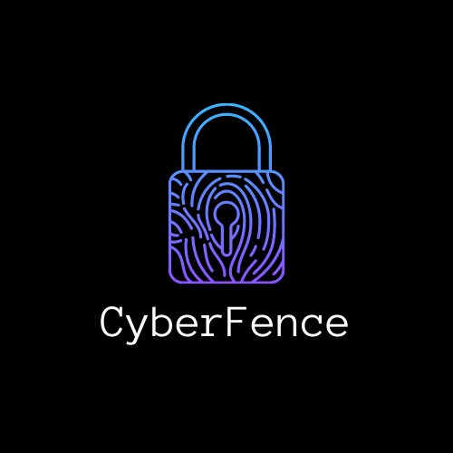

<h1 align="center">CyberFence</h1>

## Introduction:
  Living in a world driven by social media, we are constantly surrounded by other people and their opinions. While the internet has connected people from all over the world and allowed them to collaborate and share their knowledge, it has also led to an uptick in crime. Cyberbullying and online harassment are just two of the many problems that currently plague the internet. 
More often than not, victims of cyber crimes don’t come forward and even if they do report the harmful content, action taken is too little too late.   
  As young students ourselves, we have seen the kind of hatred people online are capable of firsthand. Which is why we built CyberFence. 
CyberFence is designed with the intention of being a resource that can bridge the gap between law enforcement agencies and social media corporations like Twitter by using publicly available tweets to flag people who are repeat offenders.   
  Currently, CyberFence scrapes tweets from Twitter using keywords generated from [YAKE](https://github.com/LIAAD/yake) and obtains a list of users and their tweets for a 24 hour period that might be actively engaging in cyberbullying and harassment. We then pass this data to a finetuned NLP model (BERT) that predicts whether the tweet is cyberbullying/hatespeech or not. We then process this dataset to look for any repeat offenders. If flagged we would pass this information directly to law enforcement agencies to take action. 
### Our main goal with CyberFence is to help curb cyberbullying in whatever small way we can. If we succeed in making even one individual's life better we would have succeeded in our goal.

  
## Demo Video Link:
  <a href="https://youtu.be/fp4fk-f7RAQ">https://youtu.be/fp4fk-f7RAQ</a>
  
## Presentation Link:
  <a href="https://docs.google.com/presentation/d/1FgTXGko2UO41z0IpMOHsFPuuQLeAejrxHAUj2jbr3xk/edit?usp=sharing"> CyberFence PPT Link </a>
  
  
## Table of Contents:
- streamlit_app.py - contains the code for the streamlit pages
- data folder - contains the datasets generated using keywords
- harassment_twint.py and bullying_twint.py - contains the Twint code used to generate the tweets

## Technology Stack:
  1) Python
  2) Machine Learning (NLP)
  3) Streamlit
  4) Twit Twitter Tool
  
## Track: Tech Against Crime

## Contributors:

Team Name: Team Wonder Women

* [Kiara Jacob](https://github.com/kiara-jacob)
* [Ayushi Mittal](https://github.com/AyushiNM)

### References
* https://github.com/chantelmariediaz/Predicting-Cyberbulling-on-Twitter
* https://github.com/t-davidson/hate-speech-and-offensive-language
* https://github.com/LIAAD/yake

### Made at:

